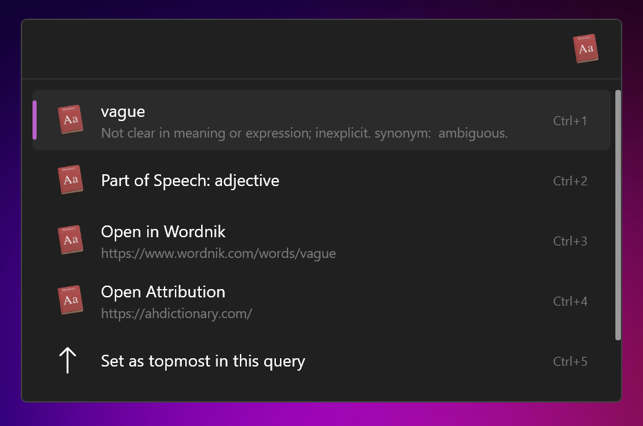
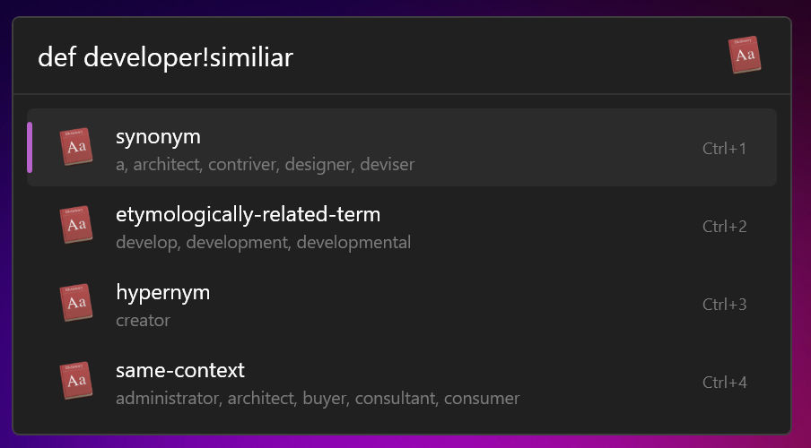
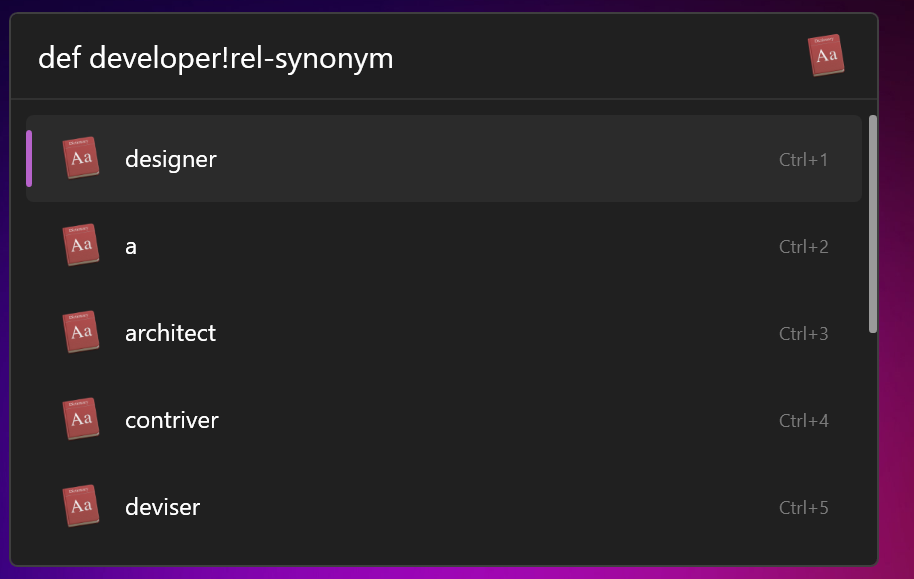
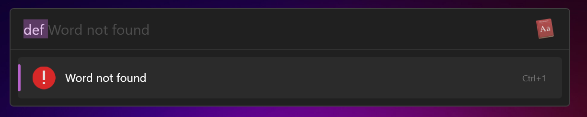
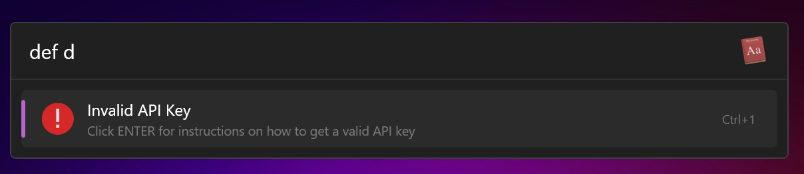

# Flow.Launcher.Plugin.WordNikDictionary
This is a plugin for [Flow Launcher](https://github.com/Flow-Launcher/Flow.Launcher) that lets you easily see the definitions of words using [wordnik](https://wordnik.com).

## Table of Contents
1. [Get an API Key](#get-an-api-key)
2. [Installation](#installation)
    - [Install via Package Manager](#install-via-package-manager)
    - [Manual Installation](#manual-installation)
        - [Download from release](#download-from-a-release)
        - [Download and build development version](#download-and-build-development-version)
3. [Features](#features)
    - [Feature List](#feature-list)

## Get an API Key
To get an API key, head to [developer.wordnik.com](https://developer.wordnik.com/), and create an account. Once you've created your account, you'll be able to fill out a form to request an api key.

## Installation
### Install via Package Manager

To Install Wordnik Dictionary through Flow's Plugin Manager, run the following command: `pm install wordnik dictionary`.

### Manual Installation
> [!WARNING]
> This method is not recommended, only do this if you know what your doing.
#### Download from a release

1. Download the zipped release file.

To download a previously released version, head to the [releases page](https://github.com/cibere/Flow.Launcher.Plugin.WordNikDictionary/releases), find the version you want, and download the zip file.

2. Extract the zip file into your plugins folder.

You can access your userdata folder through the `Flow Launcher UserData Folder` command in the system commands plugin, from there go into the `Plugins` folder, and create a new folder for your release. Extract the contents of the zip folder into the new folder you've made.

3. Restart Flow Launcher

Finally you want to restart flow launcher. You can do this via the `Restart Flow Launcher` command in the system commands plugin.

#### Download and build development version

1. Head to your plugins folder.

You can access your userdata folder through the `Flow Launcher UserData Folder` command in the system commands plugin, from there go into the `Plugins` folder.

2. Clone the repository.

> [!NOTE]
> [git](https://git-scm.com/) must be installed for this

Now you must clone the repository, which can be done with the following command: `git clone https://github.com/cibere/Flow.Launcher.Plugin.WordNikDictionary`.

3. Setup your environment

Head into the newly created folder containing the plugin, and create and activate a venv. Then run the `install_packages.bat` file from that console. That file will update pip, install the runtime libraries, and install the development libraries.

4. Restart Flow Launcher

Finally you want to restart flow launcher. You can do this via the `Restart Flow Launcher` command in the system commands plugin.


## Features

### Feature List
1. [Get the definition of a word](#get-the-definition-of-a-word)
2. [Get information about definition of a word](#get-information-about-definition-of-a-word)
3. [Search Modifiers](#search-modifiers)
    - [Filter by parts of speech](#filter-by-parts-of-speech)
    - [Get the syllables of a word](#get-the-syllables-of-a-word)
    - [Get similiar word by category](#get-similiar-word-by-category)
4. [Advanced Error Handler](#advanced-error-handler)
    - [Expected Errors](#expected-errors)
    - [Unexpected Errors](#unexpected-errors)

### Get the definition of a word
Get a list of definitions for your word from various sources. Syntax: `def word`

### Get information about definition of a word
Get information about a certain definition, and easy access to the source. This is a context menu that is avalible for all definitions.

### Search Modifiers
You can use search modifiers to filter your results by part of speech, or to get different types of information about a word. Search modifiers have the following syntax: `word!modifier`
#### Filter by parts of speech
You can filter results by parts of speech by inputting the part of speech as a modifier.
Syntax: `word!part_of_speech`.
List of acceptable parts of speech modifiers:
```
noun, adjective, verb, adverb, interjection, pronoun, preposition, abbreviation, affix, article, auxiliary-verb, conjunction, definite-article, family-name, given-name, idiom, imperative, noun-plural, noun-posessive, past-participle, phrasal-prefix, proper-noun, proper-noun-plural, proper-noun-posessive, suffix, verb-intransitive, verb-transitive
```

#### Get the syllables of a word
We can use the `syllables` search modifier to get the syllables of a word. Syntax: `def word!syllables`

#### Get categories of similiar words
To find the categories of avalible similiar words for a given word, use the following command: `def word!similiar`. To see all of the words in a given category, see the section below.

#### Get similiar word by category
To find all of the words that are similiar to a word in a specific category, use the following command: `def word!rel-category`. For a list of avalible categories for a given word, see the above section.


### Advanced Error Handler

#### Expected Errors
Expected errors will return a short, simple, and stylish error message.


#### Unexpected Errors
When unexpected errors occur, our error handler redirects it to the logs and prompts you to notify us by creating a github issue or discord thread with the logfile.

https://github.com/cibere/Flow.Launcher.Plugin.WordNikDictionary/raw/refs/heads/v2/Images/unexpected_error_handler_showcase.mp4